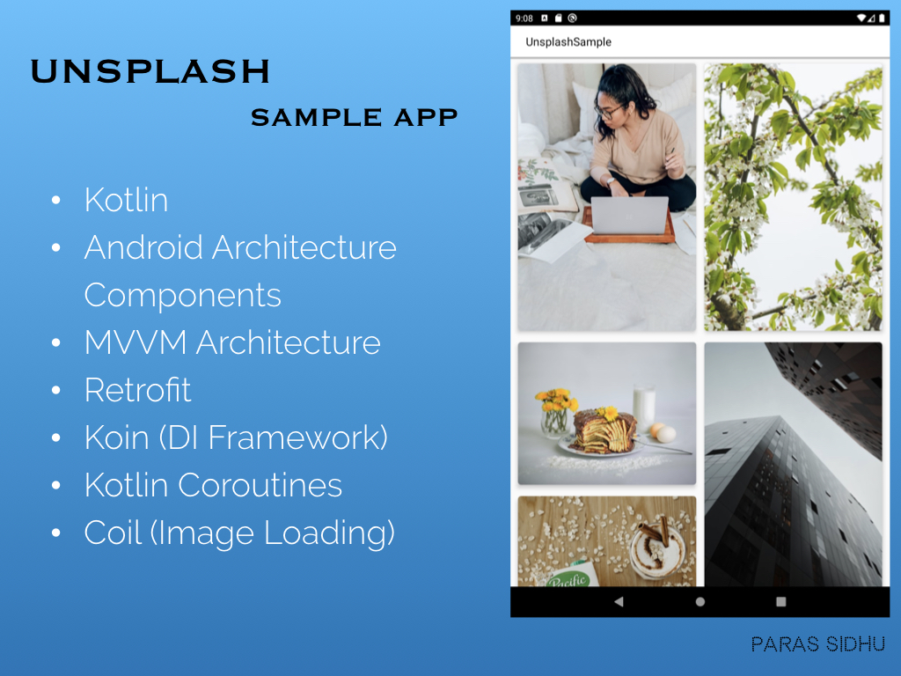
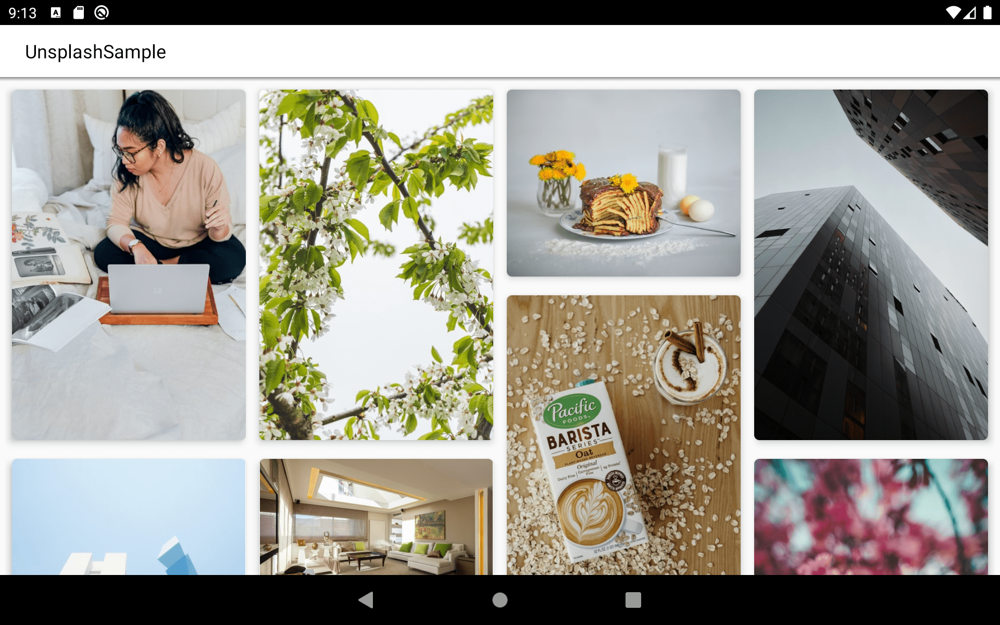

# UnsplashSample

A sample Android application written in Kotlin to fetch images from Unsplash API with Pagination and demonstrates the use of Coil (for image loading), Koin (for injecting dependencies), Retrofit, Coroutines and MVVM

### **Star :star:  this repo to show your support and it really does matter!** :clap:

## Inspiration

Although Unsplash sample apps are very common, I just wanted to explore the usage of Koin as a dependency framework in Android. Koin integration proved to be quite simpler and using DSL is a breeze. Moreover, I also used Coil to load images but it isn't used to a greater extent due to the simplicity of the app.

I used StaggeredLayoutManager as a change and implemented 4 columns in landscape mode and 2 for portrait mode. This made the app useful and eye-candy on tablets.

## Getting Started

To setup this project, just clone it first. Then obtain the API key from <a href="https://unsplash.com/documentation">here</a>! Put this key in `build.gradle` file's appropriate `API_KEY` field and run the application. That's all!

## Architecture

This application used MVVM (Model-View-ViewModel) Architecture which is Google's recommended architecture for Android apps. You can read more aboute MVVM <a href="https://developer.android.com/jetpack/docs/guide#recommended-app-arch">here</a>.

## License
MIT License

Copyright (c) 2020 Paras Sidhu

Permission is hereby granted, free of charge, to any person obtaining a copy
of this software and associated documentation files (the "Software"), to deal
in the Software without restriction, including without limitation the rights
to use, copy, modify, merge, publish, distribute, sublicense, and/or sell
copies of the Software, and to permit persons to whom the Software is
furnished to do so, subject to the following conditions:

The above copyright notice and this permission notice shall be included in all
copies or substantial portions of the Software.

THE SOFTWARE IS PROVIDED "AS IS", WITHOUT WARRANTY OF ANY KIND, EXPRESS OR
IMPLIED, INCLUDING BUT NOT LIMITED TO THE WARRANTIES OF MERCHANTABILITY,
FITNESS FOR A PARTICULAR PURPOSE AND NONINFRINGEMENT. IN NO EVENT SHALL THE
AUTHORS OR COPYRIGHT HOLDERS BE LIABLE FOR ANY CLAIM, DAMAGES OR OTHER
LIABILITY, WHETHER IN AN ACTION OF CONTRACT, TORT OR OTHERWISE, ARISING FROM,
OUT OF OR IN CONNECTION WITH THE SOFTWARE OR THE USE OR OTHER DEALINGS IN THE
SOFTWARE.
